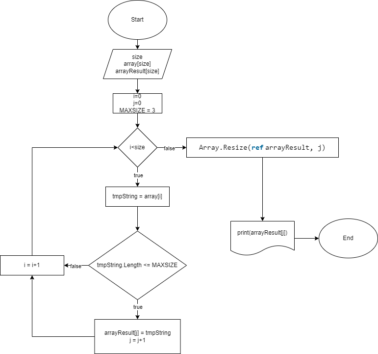

<<<<<<< HEAD
# Task_test
=======
# Итоговая работа по курсу основы программирования

**Задача**

*Написать программу, которая из имеющегося массива строк формирует новый массив из строк, длина которых меньше, либо равна 3 символам. 
Первоначальный массив можно ввести с клавиатуры, либо задать на старте выполнения алгоритма. При решении не рекомендуется пользоваться 
коллекциями, лучше обойтись исключительно массивами.*

## Репозиторий на проект
Текст [ссылка на репозиторий](https://github.com/ASegrey/Task_test.git "Репозиторий проекта")

# Алгоритм решения задачи

## Шаги решения
1. Поиск в массиве строки с длиной меньше или равной 3 символам.
2. Найденную строку переносим в итоговый массив, увеличиваем количество полученных строк на 1.
3. Продолжаем писк и перенос найденных строк в итоговый массив, до окончания исходного массива.
4. Методом изменения длины массива, по количеству полученных строк, формируем ответ.
5. Выводим ответ в консоль. 
>>>>>>> fa78037 (add description in  README.md)
